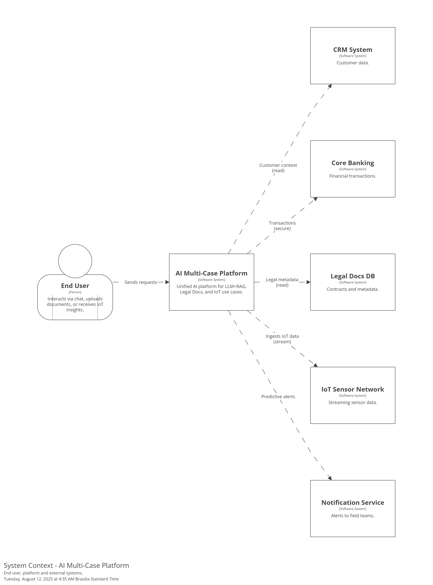
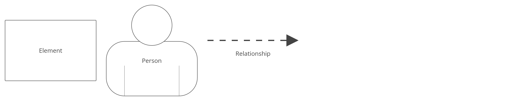
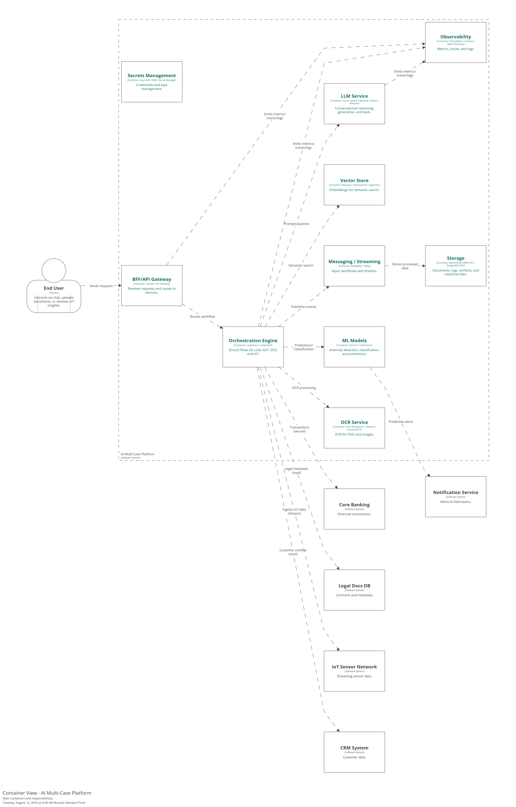
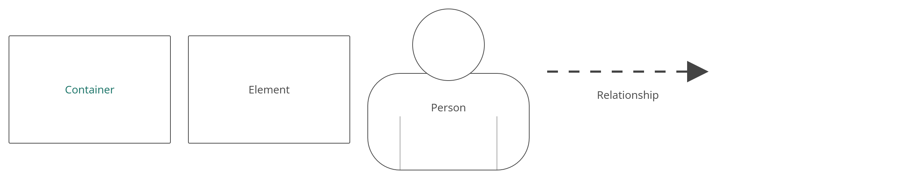
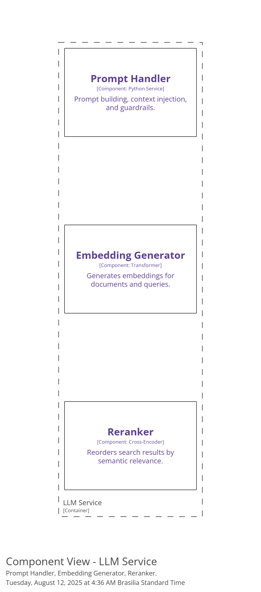
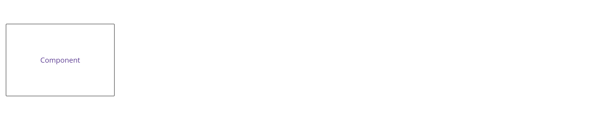

# Arquitetura – C4 (Structurizr)

Este repositório contém três diagramas do **C4 Model** (System Context → Container → Component) e suas respectivas **legendas (keys)**, gerados via **Structurizr DSL**.
A sequência das imagens foi pensada para contar a arquitetura de ponta a ponta, do macro ao micro.

## Sumário

* [Como ler os diagramas](#como-ler-os-diagramas)
* [1) System Context (SYS-CTX)](#1-system-context-sys-ctx)
* [2) Container View (CNT-AI)](#2-container-view-cnt-ai)
* [3) Component View (CMP-LLM)](#3-component-view-cmp-llm)
* [Boas práticas e próximos passos](#boas-práticas-e-próximos-passos)

---

## Como ler os diagramas

1. **Abra na ordem**: System Context → Container → Component.
2. Em cada nível, **verifique a legenda** (imagem `*-key.png`) para entender as cores, formas e significados.
3. **Setas** indicam relações (chamadas, dependências, fluxos).
4. **Caixas pontilhadas** costumam indicar limites (ex.: boundary de um sistema).

---

## 1) System Context (SYS-CTX)

**Arquivos**

* `structurizr-SYS-CTX.png`
* `structurizr-SYS-CTX-key.png` (legenda)

**Imagens**



**Objetivo do diagrama**
Mostrar **quem** interage com a plataforma e **quais sistemas externos** ela toca. É a visão “satélite” do ecossistema.

**Elementos principais**

* **End User**: pessoa que usa o chat, envia documentos ou consome insights IoT.
* **AI Multi-Case Platform**: sistema central (o que estamos desenhando).
* **Sistemas externos** (exemplos):

  * **CRM System** (contexto do cliente)
  * **Core Banking** (operações seguras)
  * **Legal Docs DB** (metadados contratuais)
  * **IoT Sensor Network** (eventos/sensores em streaming)
  * **Notification Service** (alertas para times de campo)

**O que observar**

* **Escopo**: a plataforma AI está no centro; tudo ao redor é ator ou sistema externo.
* **Relações**: setas indicam direção do uso/integração (ex.: plataforma lê do CRM; envia alertas via Notification).

---

## 2) Container View (CNT-AI)

**Arquivos**

* `structurizr-CNT-AI.png`
* `structurizr-CNT-AI-key.png` (legenda)

**Imagens**



**Objetivo do diagrama**
Exibir os **principais containers** (aplicativos e armazenamentos) que compõem a plataforma, e como se comunicam.

**Containers (resumo)**

* **BFF/API Gateway**: recebe requisições do usuário e expõe endpoints (ex.: FastAPI).
* **Orchestration Engine**: orquestra fluxos (LLM, NLP, OCR, IoT) – ex.: LangChain/LangGraph.
* **Vector Store**: guarda embeddings para busca semântica (Weaviate/Elastic/pgvector).
* **LLM Service**: raciocínio conversacional e ferramentas (Azure OpenAI/Bedrock/Vertex/watsonx).
* **OCR Service**: extração de texto de PDFs/imagens (Form Recognizer/Textract/Document AI).
* **ML Models**: classificação, anomalia, predição (PyTorch/Scikit-learn).
* **Messaging/Streaming**: assíncrono e streams (RabbitMQ/Kafka).
* **Storage**: objetos e relacional (Blob/S3/GCS/IBM COS + PostgreSQL/Db2).
* **Observability**: métricas, traços e logs (Prometheus/Grafana/OTel).
* **Secrets Management**: cofres e KMS.

**Fluxos típicos (exemplos)**

* **Assistente (LLM+RAG)**: `BFF → Orchestration → LLM Service` (consulta) + `Vector Store` (recuperação semântica) + `Storage` (histórico).
* **Documentos Jurídicos**: `BFF → Orchestration → OCR Service → ML Models` e indexação no `Vector Store`.
* **IoT**: `IoT Sensor Network → Messaging/Streaming → ML Models` (detecção/predição) → `Notification Service`.

**O que observar**

* **Acoplamento fraco** via mensageria.
* **Separação de responsabilidades** por container.
* **Observabilidade e segredos** como **first-class citizens**.

---

## 3) Component View (CMP-LLM)

**Arquivos**

* `structurizr-CMP-LLM.png`
* `structurizr-CMP-LLM-key.png` (legenda)

**Imagens**



**Objetivo do diagrama**
Entrar no **container “LLM Service”** e mostrar seus **principais componentes internos**.

**Componentes (exemplo)**

* **Prompt Handler**: construção de prompts, injeção de contexto, guardrails (PII/políticas).
* **Embedding Generator**: geração de embeddings para documentos e queries.
* **Reranker**: reordena resultados da busca por relevância (Cross-Encoder).

**Fluxo típico**

1. A **Orchestration** envia a consulta e o contexto ao **Prompt Handler**.
2. Se necessário, o **Embedding Generator** é chamado para vetorizar.
3. Resultados recuperados do **Vector Store** são refinados pelo **Reranker**.
4. O **LLM** produz a resposta final com segurança e rastreabilidade (observabilidade ativa).

**O que observar**

* **Guardrails** aplicados cedo (no Prompt Handler).
* **RAG** explícito (Embedding + Reranker + Vector Store).
* Componentes **substituíveis** (multi-cloud / multi-model).

---

## Boas práticas e próximos passos

**Boas práticas**

* **Multi-cloud ready**: isolar integrações (LLM, OCR, busca) atrás de interfaces.
* **Reuso**: padronizar embeddings e API de vector store para trocar provedores sem refatorar.
* **Observabilidade total**: OTel em todas as rotas; SLOs por cenário (p95, custo/token, acurácia).
* **Segurança**: segredos em KMS/Key Vault; políticas de PII/PCI/PHI centralizadas (policy-as-code).
* **Infra como código**: Terraform + módulos reutilizáveis por cloud e região.
* **Pipelines imutáveis**: versionar prompts/modelos/datasets (MLflow/DVC).

**Próximos passos**

1. Publicar o **DSL** no repositório para rastreabilidade dos diagramas.
2. Anexar **KPIs de cada caso** (Assistente, Jurídico, IoT) como *properties* no Structurizr.
3. Adicionar **camadas de implantação (Deployment View)** por região (EUA/Canadá/EU).
4. Conectar este README ao **roadmap de rollout** (datas e gates de Go/No-Go).

---

Aqui está um **README** pronto, em português, representando as **layers/camadas** dos **3 projetos**. É só colar no repositório.

---

# Arquitetura por Camadas – 3 Projetos (LLM + RAG, Jurídico, IoT)

Este documento descreve a arquitetura em **camadas (layers)** de três soluções de IA:

1. **Assistente Virtual Multicanal (LLM + RAG)**
2. **Agente Autônomo para Documentos Jurídicos (OCR + NLP)**
3. **Chat Operacional IoT (Diagnóstico + Predição)**

O objetivo é facilitar **apresentação técnica**, **alinhamento de arquitetura** e **reuso** entre projetos.

---

## Como ler

* Cada projeto tem um **fluxo vertical** (da interface → backend → orquestração → modelos/dados → observabilidade/segurança).
* As **stacks** são listadas **por camada**, para rápida referência e substituição.

---

## 1) Assistente Virtual Multicanal (LLM + RAG)

### Camadas

```
[ Canais & UI ]
        ↓
[ API Gateway / BFF ]
        ↓
[ Orquestração de Conversa ]
        ↓
[ Tools/Agents Empresariais ]
        ↓
[ LLM & Guardrails ]
        ↓
[ RAG: Indexação / Busca Semântica ]
        ↓
[ Dados & Integrações ]
        ↓
[ Observabilidade | Segurança | DevOps | Testes/MLOps ]
```

### Stacks por camada

* **Canais & UI:** Web chat, App, WhatsApp (Twilio/Meta), WebSocket/SignalR
* **API Gateway / BFF:** FastAPI, NGINX/API Gateway, Redis (cache)
* **Orquestração de Conversa:** LangChain, LangGraph (roteamento, memory, ferramentas)
* **Tools/Agents:** Conectores para CRM, Core Banking (read-only), Billing, Jira/ServiceNow, OCR
* **LLM & Guardrails:** OpenAI/Claude/Gemini, Pydantic guards, checagem PII, políticas de conteúdo
* **RAG (Index/Busca):** Chunking, Sentence-Transformers/BERT, Azure Cognitive Search/Weaviate/pgvector, TF-IDF (fallback), re-ranker (Cross-Encoder)
* **Dados & Integrações:** PostgreSQL (conversas), S3/Blob (docs), RabbitMQ (assíncrono), webhooks
* **Observabilidade / Segurança / DevOps / Testes:** OpenTelemetry, Prometheus/Grafana, OAuth2/OIDC + Key Vault/KMS, Docker, Kubernetes (AKS/EKS/GKE), Terraform, GitHub Actions/Jenkins, Pytest, Locust, MLflow, RAGAS

---

## 2) Agente Autônomo para Documentos Jurídicos (OCR + NLP)

### Camadas

```
[ Ingestão & OCR ]
        ↓
[ Pipeline NLP (NER/CLF/Extratores) ]
        ↓
[ API & Backoffice ]
        ↓
[ Busca Semântica / Indexação ]
        ↓
[ Armazenamento & Eventos ]
        ↓
[ Observabilidade | Segurança | DevOps | Testes/MLOps ]
```

### Stacks por camada

* **Ingestão & OCR:** Upload web/API, Azure Form Recognizer / AWS Textract / GCP Document AI, Tesseract (fallback), pré-processamento (deskew/denoise)
* **Pipeline NLP:** spaCy (NER), HuggingFace Transformers (classificação/extração), PyTorch (fine-tuning quando necessário)
* **API & Backoffice:** FastAPI (REST), Painel admin (React/FastAPI-admin), JWT/OIDC
* **Busca Semântica / Indexação:** Elastic/OpenSearch (BM25 + kNN), Sentence-BERT, re-ranker
* **Armazenamento & Eventos:** PostgreSQL (metadados), S3/Blob/GCS (PDFs), RabbitMQ/Celery (lotes)
* **Observabilidade / Segurança / DevOps / Testes:** OpenTelemetry, Prometheus/Grafana, Vault/Key Vault, Docker, Kubernetes, Terraform, GitHub Actions, Pytest, Great Expectations (qualidade de dados), Locust, MLflow, DVC

---

## 3) Chat Operacional IoT (Diagnóstico + Predição)

### Camadas

```
[ Canais & UI (Chat) ]
        ↓
[ BFF / API ]
        ↓
[ Orquestração (Ferramentas/Agentes) ]
        ↓
[ Modelos de Predição / Anomalias ]
        ↓
[ Streams & Time Series ]
        ↓
[ RAG Técnico + Catálogos ]
        ↓
[ Observabilidade | Segurança | DevOps | Testes/MLOps ]
```

### Stacks por camada

* **Canais & UI:** Chat web/app, notificações/push para manutenção
* **BFF / API:** FastAPI, NGINX, Redis (cache)
* **Orquestração:** LangChain Tools (funções: consultar sensor, gerar diagnóstico, abrir OS)
* **Modelos de Predição / Anomalias:** scikit-learn (IsolationForest), PyTorch (LSTM/Transformer), Feast (feature store opcional)
* **Streams & Time Series:** Kafka/MSK/Event Hubs/Event Streams, Flink/Kafka Streams/Dataflow, TimescaleDB/Timestream/Bigtable, pgvector
* **RAG Técnico + Catálogos:** Manuais e histórico de manutenção, Sentence-BERT, Weaviate/pgvector, re-ranker
* **Observabilidade / Segurança / DevOps / Testes:** Prometheus/Grafana/Loki, Alertmanager, mTLS, RBAC, Vault/Key Protect, Kubernetes (EKS/GKE/AKS/ROKS), Helm, Terraform, Jenkins/GitHub Actions, Pytest, k6/Locust, MLflow

---

## Reuso entre projetos (camadas comuns)

* **BFF/API**, **Orquestração**, **Vector Store/Busca**, **Observabilidade**, **Segurança de Segredos (KMS/Key Vault)**, **CI/CD & IaC** são **comuns** aos 3 cenários.
* **LLM & Guardrails** e **RAG** aparecem em Assistente e podem apoiar Jurídico e IoT (base de conhecimento técnica).
* **Mensageria/Streaming** é central em IoT e útil como padrão assíncrono nos demais.

---

## Boas práticas (multi-cloud / multi-tenant)

* **Abstração de provedores**: drivers para LLM/OCR/Busca (troca Azure↔AWS↔GCP↔IBM sem refatorar fluxo).
* **Padrão de embeddings** e **API única** para vetor store (FAISS/pgvector/Weaviate).
* **Isolamento por tenant**: namespaces K8s, índices com prefixo, chaves KMS dedicadas.
* **Cache semântico + re-ranker local** para reduzir custo de tokens/latência.
* **Observabilidade por domínio**: OTel em todas as rotas; SLOs (p95, custo/token, acurácia).
* **Infra como código**: Terraform modular por região/cloud; pipelines imutáveis (MLflow/DVC).
* **Guardrails e compliance**: PII/PCI/PHI via policy-as-code (OPA/Conftest) e mascaramento.

---

## Notas de implantação (resumo)

* **Deploy seguro**: canary 5%→25%→50%→100%, auto-rollback por SLO.
* **Dados e índices**: migrações (Flyway/Liquibase), versionamento de coleções vetoriais.
* **Segredos**: KMS/Key Vault/Secret Manager; rotação automática.
* **Custo**: tags por tenant, dashboards de custo/token e throughput; rightsizing semanal.
